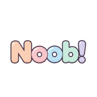
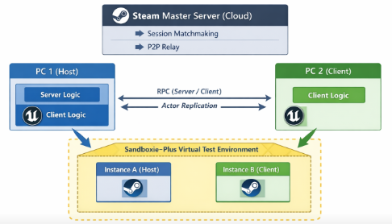
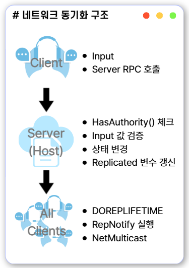
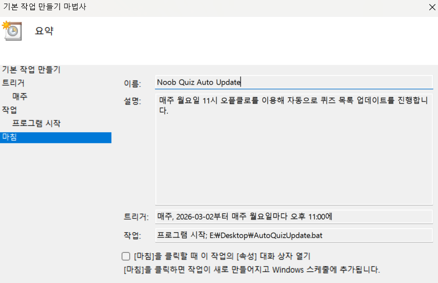
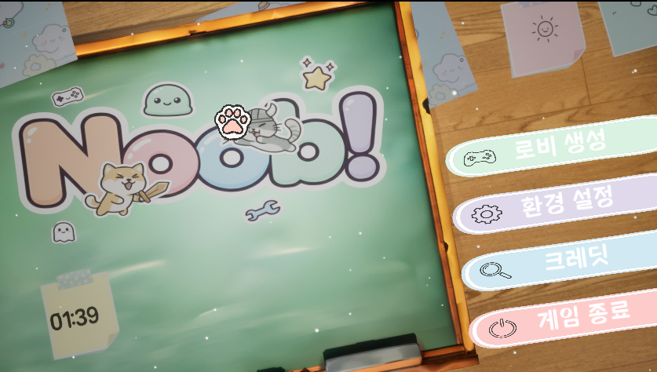
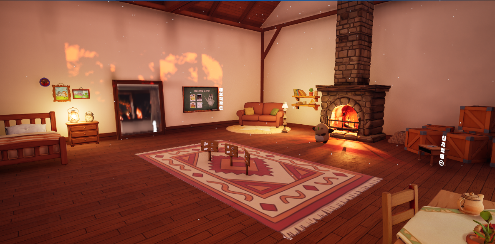
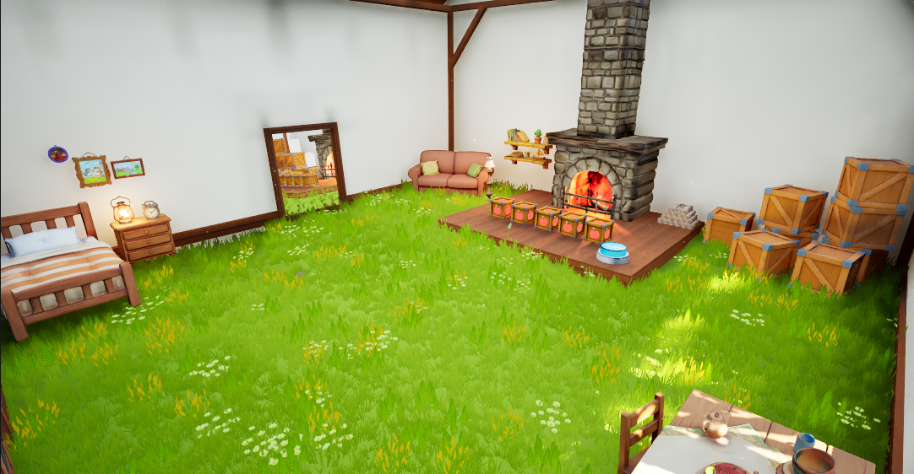
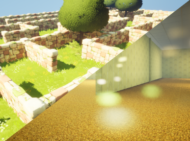
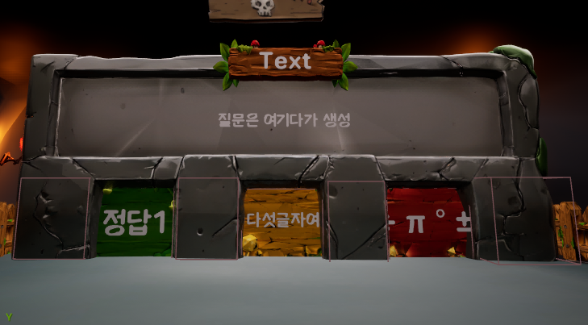

# 🎮 NoobGame (Multiplayer Party Game Project)



> **"다양한 미니게임을 친구들과 함께 즐기는 멀티플레이어 파티 게임"**
>
> *언리얼 엔진 5를 활용한 네트워크 게임 개발 포트폴리오입니다.*

---

## 📋 1. 프로젝트 개요 (Overview)

*   **프로젝트명:** NoobGame
*   **장르:** 멀티플레이어 파티 / 캐주얼 / 서바이벌
*   **개발 인원:** 1인 개발 (원우)
*   **역할:** 기획, 디자인, 레벨 디자인, 애니메이션 리깅, 사운드, 서버 및 시스템 구현 등 **프로젝트 전 과정 단독 수행**
*   **개발 기간:** 2025.07 ~ 2026.02
*   **플랫폼:** PC (Steam)
*   **핵심 목표:**
    *   **프로젝트 전 과정 습득:** 아이디어 기획부터 아트 리소스 제작(리깅, 애니메이션), 프로그래밍, 빌드 및 배포까지 1인 개발의 전체 파이프라인 경험.
    *   언리얼 엔진의 **Replication(네트워크 동기화)** 시스템 심층 이해 및 구현 (Dedicated Server 기반 구조 설계).
    *   확장 가능한 모듈형 게임 아키텍처 설계 (다양한 장르의 미니게임을 하나의 프로젝트에 통합).
    *   **OpenClaw** 자동화 실무 적용

## 🎥 2. 플레이 영상 (Gameplay Video)

### 메인메뉴 설명

https://github.com/user-attachments/assets/08556ad7-3f5f-4681-85f7-af2bcddab710

### 로비 설명

https://github.com/user-attachments/assets/e6ce7e65-6b4a-4ab7-bad6-3b3355ada88d

### 과일 게임 설명

https://github.com/user-attachments/assets/2a747485-3d5a-4303-8409-9b373c8d959f

### 미로 게임 설명

https://github.com/user-attachments/assets/e2016d0f-6a71-4a60-be45-46d8475533fc

### 퀴즈 게임 설명

https://github.com/user-attachments/assets/a65cd33b-5add-4331-88d7-b9d11cbe08e7

---

## 🛠️ 3. 사용 기술 (Tech Stack)

### Engine & Language
*   **Unreal Engine 5.6**: Core Engine (최신 기능 활용)
*   **C++ & Blueprints**: 하이브리드 구조 (C++로 핵심 시스템 구현, BP로 로직/UI 연결)
*   **Visual Studio 2022**: IDE

### Modeling
*   **Blender**: 기초적인 Mesh 생성 및 Rigging, AI로 생성된 Mesh 수정

### Generative AI Tools
*   **Tripo 3D**: 3D 에셋 생성 및 프로토타이핑
*   **Nano Banana**: 텍스처 및 이미지 리소스 생성
*   **Rodin AI**: 3D 모델 최적화 및 변환

### Version Control
*   **Git / GitHub**: 소스 코드 관리
*   **Git LFS**: 대용량 에셋(.blend, .uasset) 관리

---

## 🔗 4. 멀티플레이 환경 구성



*   멀티플레이 환경은 Steam Online Subsystem(OSS) 기반으로 구축했습니다. 대중성과 안정적인 기능 지원을 고려해 채택했습니다.
*   테스트는 단일 PC 환경에서의 동시 실행 검증을 위해 Sandboxie-Plus를 활용했습니다.
*   네트워크 구조는 Listen Server 기반 P2P 매치메이킹을 기준으로 설계하고 각 기능을 구현했습니다.
*   옵션 데이터는 SaveGame 클래스를 통해 사용자별로 분리 저장되도록 설계했습니다.

## 🔗 5. 네트워크 동기화를 위해 구현한 기능



### RPC
*   **사용 목적** : 서버 권위 모델을 기반으로 클라이언트의 임의 데이터 조작을 원천 차단하고, 통신 주체별 RPC 설계를 통해 네트워크 신뢰성과 응답성을 동시에 확보하기 위해 도입했습니다.
*   **실제 적용** : 
         - Server RPC : 과일 게임에서 클라이언트의 정답 제출을 서버로 전달.
         - Client RPC : 정답이 틀릴 경우 오답 갯수를 해당 유저에게만 노출.
         - NetMulticast : 정답일 시 모든 유저에게 승자를 알려주는 텍스트 노출.
### Property Replication
*   **사용 목적** : 모든 플레이어가 동일한 게임 상태를 공유하도록 하여 경쟁 게임의 공정성을 확보하기 위해 도입했습니다.
*   **실제 적용** : 미니게임의 남은 시간을 모든 클라이언트가 오차 없이 인지하도록 동기화
### RepNotify
*   **사용 목적** : 불필요한 패킷 전송을 줄이고, 변수 값이 변경되는 정확한 시점에 시각적/청각적 피드백을 제공하여 네트워크 효율성을 높이기 위해 도입했습니다.
*   **실제 적용** : 게임 종료 시 OnRep_ 함수를 통해 즉시 폭죽 VFX와 사운드 재생.

## 🔗 6. OpenClaw를 활용한 퀴즈 업데이트 자동화 과정
*   **아이디어** : 고정된 퀴즈 리스트로 인한 유저 지루함 및 패턴 고착화 방지 필요했습니다. 이에, 로컬에 접속 가능한 OpenClaw를 활용해 퀴즈 리스트 JSON 자동 업데이트 시스템을 구축했습니다.
*   **과정** :
         1. 확장성과 파싱 효율을 고려하여 퀴즈 DB를 JSON 포맷으로 규격화
    
         2. 프로젝트 폴더에 트리거(TRIGGER_UPDATE.txt)를 생성하는 Bat 파일 생성
          ```
         @echo off
         echo WAKE UP > "E:\NoobGame\TRIGGER_UPDATE.txt"
          ```
    
         3. 작업 스케쥴러를 통해 매주 월요일 23:00 해당 Bat 파일이 실행되도록 예약
          
    
         4. OpenClaw의 HeartBeat 기능을 커스텀하여 트리거 파일 감지 시 퀴즈 JSON 업데이트 수행.

## 🎮 7. 레벨 구성도 및 구현

### 7.1 메인메뉴


* **역할**: 사용자 경험(UX)을 고려한 직관적인 UI를 제공하며, Steam Online Subsystem을 통해 멀티플레이 세션을 생성하거나 초대 받아 게임에 진입하는 게이트웨이 역할을 합니다.
* **구현**:
   - 세션 관리: Find Sessions와 Create Session 기능을 UI 버튼과 바인딩하여, 서버 브라우저를 통해 다른 플레이어의 방에 입장할 수 있도록 구현했습니다.
   - 애니메이션 UI: WBP_MainMenu 위젯에서 버튼 호버 이펙트 및 레벨 전환 시 페이드 인/아웃 처리를 통해 시각적 완성도를 높였습니다.

### 7.2 로비 및 NPC AI (Lobby & NPC AI)


* **역할**: 플레이어가 게임 진입 전 대기하는 허브 공간입니다. 단순 UI 방식에서 벗어나 맵 내 배치된 상호작용 Actor를 통해 Steam 친구 초대, 미니게임 선택, NPC 대화 등 인게임 월드와 유기적으로 연결된 활동이 가능하도록 설계했습니다.
* **구현**:
   - World-Space Interaction: Steam SDK와 연동된 특정 오브젝트(예: 게시판, 단말기 등)에 접근 시 세션 초대 및 게임 모드 선택 인터페이스가 활성화되도록 구현했습니다.
   - State-Based AI: Behavior Tree와 Blackboard를 기반으로 NPC AI를 구축하여 자율 순찰(Patrol) 및 플레이어 인식 시 시선 추격(Head Tracking) 등의 상태 기반 로직을 구현했습니다.

<details>
<summary>💻 NPC AI 상호작용 로직 (LobbyNPCAIController.cpp) - 접기/펼치기</summary>

```cpp
void AMyNPC::Interact_Implementation(APlayerController* InteractedPlayerController)
{
    if (bIsOccupied) return;
    if (HasAuthority()) bIsOccupied = true;

    // 상호작용 시작 시 AI의 자율 행동(비헤이비어 트리 등) 중지
    if (AAIController* AICon = Cast<AAIController>(GetController()))
    {
        AICon->StopMovement();
        if (AICon->GetBrainComponent()) AICon->GetBrainComponent()->StopLogic("Interaction Started");
    }

    // 현재 재생 중인 애니메이션 중지
    UAnimInstance* AnimInst = GetMesh()->GetAnimInstance();
    if (AnimInst) AnimInst->Montage_Stop(0.2f);
}

void AMyNPC::StartDialogue(APlayerController* PC)
{
    if (!PC || !PC->IsLocalController()) return;
    CurrentInteractingPC = PC;
    bIsDialogueMode = true;

    // 플레이어를 향한 타겟 회전값 계산
    FVector Dir = CurrentInteractingPC->GetPawn()->GetActorLocation() - GetActorLocation();
    Dir.Z = 0.0f;
    TargetRotation = FRotationMatrix::MakeFromX(Dir).Rotator();

    // 대화 위젯 생성 및 마우스 커서 활성화
    if (NpcTalkWidgetClass)
    {
        CurrentTalkWidget = CreateWidget<UUserWidget>(CurrentInteractingPC, NpcTalkWidgetClass);
        if (CurrentTalkWidget)
        {
            CurrentTalkWidget->AddToViewport();
            FInputModeUIOnly InputMode;
            InputMode.SetWidgetToFocus(CurrentTalkWidget->TakeWidget());
            CurrentInteractingPC->SetInputMode(InputMode);
            CurrentInteractingPC->bShowMouseCursor = true;
        }
    }
}
```
</details>

### 7.3 과일 게임 (Fruit Game)


* **진행 방식**: 1v1 턴제 기반 추리 게임입니다. 서버는 각 플레이어에게 고유한 과일 정답 조합(`SecretAnswers`)을 부여하며, 플레이어는 매 턴 상대의 조합을 추측합니다. 서버는 일치 개수를 계산해 양측 클라이언트에 동기화합니다.
* **승리 방식**: 상대방의 과일 5개를 종류와 순서에 맞춰 **가장 먼저 모두 맞춘 플레이어**가 승리합니다.
* **구현 내용**:
    - **Server-Side Validation**: 모든 정답 판정 로직을 서버 권한(`Authority`)이 있는 `GameMode`에서 처리하여 클라이언트 측의 데이터 변조 및 부정행위를 원천 차단했습니다.
    - **RPC 기반 실시간 피드백**: 플레이어의 추측값은 `Server RPC`로 수신하고, 판정 결과는 `Client RPC`를 통해 공격자와 방어자에게 각각 전송하여 UI 업데이트 및 게임 흐름을 제어합니다.
    - **턴제 관리 시스템**: 플레이어의 입력 상태를 서버에서 관리하고, 추측 완료 후 유효성 검사를 거쳐 자동으로 턴을 교체하는 로직을 구현했습니다.

<details>
<summary>💻 정답 비교 및 결과 처리 코드 (FruitGameMode.cpp) - 접기/펼치기</summary>

```cpp
void AFruitGameMode::ProcessPlayerGuess(AController* PlayerController, const TArray<EFruitType>& GuessedFruits)
{
    if (!IsPlayerTurn(PlayerController)) return;

    // ... (중략: 상대방 플레이어 찾기 로직) ...

    const TArray<EFruitType>& OpponentSecret = OpponentPS->GetSecretAnswers_Server();
    int32 MatchCount = 0;
    
    // 정답 비교 로직
    for (int32 i = 0; i < 5; ++i)
    {
        if (GuessedFruits.IsValidIndex(i) && OpponentSecret.IsValidIndex(i) &&
            GuessedFruits[i] == OpponentSecret[i] && GuessedFruits[i] != EFruitType::FT_None)
        {
            MatchCount++;
        }
    }

    // 결과 전송 (RPC)
    AFruitPlayerController* GuesserPC = Cast<AFruitPlayerController>(PlayerController);
    AFruitPlayerController* OpponentPC = Cast<AFruitPlayerController>(OpponentPS->GetPlayerController());
    if (GuesserPC) GuesserPC->Client_ReceiveGuessResult(GuessedFruits, MatchCount);
    if (OpponentPC) OpponentPC->Client_OpponentGuessed(GuessedFruits, MatchCount);

    if (MatchCount == 5) StartWinnerAnnouncement(PlayerController->PlayerState);
    // ...
}
```
</details>

### 7.4 미로 게임 (Maze Game)


* **진행 방식**: 서버에서 생성된 시드(Seed)값을 기반으로 모든 플레이어에게 동일한 구조의 미로를 절차적으로 생성합니다. 플레이어들은 미로 속에서 먼저 탈출하기 위해 경쟁합니다.
* **승리 방식**: 미로의 종착지에 위치한 고기 오브젝트(GoalTrigger)에 가장 먼저 도달하는 플레이어가 승리합니다. 도달 즉시 서버 판정을 통해 게임이 종료됩니다.
* **구현 내용**:
   - Procedural Algorithms: 미로의 형태적 다양성을 위해 Recursive Backtracking(길고 구불구불한 경로)과 Prim's Algorithm(복잡한 갈림길)을 선택적으로 사용할 수 있도록 설계했습니다.
   - Random Seed-Based Sync: 입장 시 서버가 랜덤하게 단일 시드값을 생성하여 모든 클라이언트에게 공유합니다. 이 시드값을 통해 모든 플레어에게 동일한 미로가 생성됩니다.
   - Data Replication: 미로 내 프롭(Prop) 위치와 조명 데이터를 GameState의 리플리케이션 변수로 관리하여, 서버와 클라이언트 간의 시각적 불일치를 방지했습니다.

<details>
<summary>📖 알고리즘 관련 공부 내용 - 접기/펼치기</summary>

---
   
## 1. Recursive Backtracking (재귀 백트래킹)

### 핵심 개념
**DFS(깊이 우선 탐색)**와 **스택(Stack)**을 이용한 방식입니다.

### 특징
- 한 방향으로 끝까지 파고드는 성질 때문에 길고 구불구불한 경로가 생성됩니다.
- 막다른 길이 상대적으로 적고 전체적인 흐름이 뚜렷하여, 플레이어가 긴 호흡으로 길을 찾게 만드는 몰입감을 줍니다.

### 동작 원리
1. 현재 셀에서 방문하지 않은 무작위 인접 셀을 선택합니다.
2. 선택한 셀 사이의 벽을 허물고 이동하며, 해당 셀을 스택에 넣고 방문 표시를 합니다.
3. 더 이상 방문할 인접 셀이 없으면, 방문 가능한 셀이 나올 때까지 스택에서 Pop하여 이전 단계로 되돌아갑니다 (Backtrack).
4. 스택이 완전히 빌 때까지 이 과정을 반복합니다.

---

## 2. Prim's Algorithm (프림 알고리즘)

### 핵심 개념
MST(최소 신장 트리) 개념을 미로 생성에 응용한 방식입니다.

### 특징
- 특정 지점에서 사방으로 뻗어 나가는 형태를 띠며, 복잡한 갈림길과 짧은 막다른 길이 다수 생성됩니다.
- 선택지가 많아 플레이어에게 잦은 판단을 요구하므로 체감 난이도가 높게 형성됩니다.

### 동작 원리
1. 무작위 셀을 하나 선택해 '미로 집합'에 포함시키고, 그 셀에 인접한 모든 **벽(Wall)**을 리스트에 추가합니다.
2. 리스트에서 무작위로 벽 하나를 선택합니다.
3. 만약 선택한 벽이 미로에 포함되지 않은 새로운 셀과 연결된다면, 그 벽을 허물고 해당 셀을 미로 집합에 포함시킵니다.
4. 새로 추가된 셀의 인접 벽들을 다시 리스트에 넣고, 리스트가 빌 때까지 반복합니다.
</details>


<details>
<summary>💻 미로 생성 및 동기화 코드 (MazeGenerate.cpp) - 접기/펼치기</summary>

```cpp
void AMazeGenerate::UpdateMazeWithSeed(int32 NewSeed)
{
    this->Seed = NewSeed;

    // 1. 기존 액터 정리 (Goal, Mesh, Lights)
    if (SpawnedGoalActor) { SpawnedGoalActor->Destroy(); SpawnedGoalActor = nullptr; }
    // ... (중략: 정리 로직) ...

    // 2. 미로 알고리즘 실행
    this->ClearMaze();
    this->UpdateMaze();

    // 3. 서버 권한(Authority)이 있는 경우 랜덤 데이터를 생성하여 GameState에 저장 (Replication)
    if (HasAuthority())
    {
        if (AMazeGameState* GS = Cast<AMazeGameState>(UGameplayStatics::GetGameState(GetWorld())))
        {
            TArray<FMazePropData> PD;
            GenerateRandomPropData(PD);
            GS->SetMazePropData(PD); // GameState를 통해 클라이언트에 전파

            TArray<FMazeLightData> LD;
            GenerateRandomLightData(LD);
            GS->SetMazeLightData(LD);
        }
    }

    // 4. 탈출구(Goal) 스폰
    SpawnGoalTrigger(GetActorLocation(), GetActorScale3D());
}

void AMazeGenerate::GenerateRandomPropData(TArray<FMazePropData>& OutData)
{
    if (RandomPropMeshes.Num() == 0 || SpawnProbability <= 0.0f) return;

    for (int32 y = 0; y < MazeSize.Y; y++) {
        for (int32 x = 0; x < MazeSize.X; x++) {
            // 길(Path, 1)이면서 시작점이나 끝점이 아닌 곳에 확률적으로 스폰
            if (MazeGrid.IsValidIndex(y) && MazeGrid[y].IsValidIndex(x) && MazeGrid[y][x] == 1) {
                if ((x == 0 && y == 0) || (x == PathEnd.X && y == PathEnd.Y)) continue;

                if (FMath::FRand() < SpawnProbability) {
                    FMazePropData D;
                    D.MeshIndex = FMath::RandRange(0, RandomPropMeshes.Num() - 1);
                    float OffX = MazeCellSize.X * 0.3f;
                    float OffY = MazeCellSize.Y * 0.3f;

                    D.RelativePos = FVector(x * MazeCellSize.X + FMath::RandRange(-OffX, OffX),
                        y * MazeCellSize.Y + FMath::RandRange(-OffY, OffY), 50.0f);
                    D.Rotation = FRotator(0.f, FMath::FRandRange(0.f, 360.f), 0.f);
                    OutData.Add(D);
                }
            }
        }
    }
}

```
</details>

### 7.5 퀴즈 게임 (Quiz Game)


* **진행 방식**: 플레이어는 전방에서 다가오는 퀴즈 장애물(QuizObstacle)을 마주하게 됩니다. 장애물에는 문제와 선택지(O/X 또는 다지선다)가 표시되며, 플레이어는 제한 시간 내에 정답 구역으로 이동해야 합니다. 게임이 진행될수록 장애물의 이동 속도가 단계적으로 상승합니다.
* **승리 방식**: 장애물 충돌 없이 끝까지 생존하거나, 준비된 모든 퀴즈 리스트를 소진했을 때 최종 점수가 더 높은 플레이어가 승리합니다. 오답 구역에 머물러 장애물에 충돌할 경우 즉시 탈락 처리됩니다.
* **구현 내용**:
   - Data-Driven Quiz System: UDataTable을 활용하여 문제 내용, 선택지 개수, 정답 데이터를 구조화했습니다. 이를 통해 코드 수정 없이도 퀴즈 콘텐츠를 손쉽게 확장하거나 편집할 수 있도록 설계했습니다.
   - Dynamic Obstacle Spawning: 퀴즈 데이터의 선택지 개수에 따라 2지선다 또는 3지선다용 장애물 클래스를 동적으로 선택하여 스폰하는 로직을 구현했습니다.
   - Adaptive Difficulty Curve: SpawnedQuizCount를 추적하여 일정 주기마다 CurrentMoveSpeed를 점진적으로 증가시키는 레벨링 시스템을 적용하여 게임의 긴장감을 유지했습니다.
<details>
<summary>💻 퀴즈 스폰 및 속도 증가 로직 (OXQuizGameMode.cpp) - 접기/펼치기</summary>

```cpp
void AOXQuizGameMode::SpawnNextQuizObstacle()
{
    if (!MyGameState || MyGameState->CurrentGamePhase != EQuizGamePhase::GP_Playing) return;

    FQuizData Quiz;
    if (RemainingQuizList.Num() > 0)
    {
        // 랜덤 문제 선택
        int32 Idx = FMath::RandRange(0, RemainingQuizList.Num() - 1);
        Quiz = RemainingQuizList[Idx];
        RemainingQuizList.RemoveAt(Idx);

        // 2지선다/3지선다에 맞는 장애물 클래스 선택
        TSubclassOf<AQuizObstacleBase> ObstacleClass = (Quiz.Answers.Num() == 2) ? QuizObstacleClass_2Choice : QuizObstacleClass_3Choice;

        if (ObstacleClass)
        {
            if (AQuizObstacleBase* NewObs = GetWorld()->SpawnActor<AQuizObstacleBase>(ObstacleClass, ObstacleSpawnTransform, SP))
            {
                NewObs->InitializeObstacle(Quiz, CurrentMoveSpeed);
                ++SpawnedQuizCount;

                // 5문제마다 속도 레벨 증가
                if (SpawnedQuizCount % 5 == 0 && SpeedLevels.IsValidIndex(CurrentSpeedLevelIndex + 1))
                {
                    CurrentSpeedLevelIndex++;
                    CurrentMoveSpeed = SpeedLevels[CurrentSpeedLevelIndex];
                    if (MyGameState) MyGameState->SetCurrentSpeedLevel(CurrentSpeedLevelIndex + 1);
                }
                // ...
            }
        }
    }
    // ...
}
```
</details>

---

## 📚 8. 기술 문서 (Technical Docs)

### 8.1 네트워크 아키텍처 (Network Architecture)
* **Steam Online Subsystem 통합**: Steam SDK를 기반으로 세션 생성(CreateSession), 검색(FindSessions), 참여(JoinSession) 로직을 구현하여 별도의 IP 입력 없이도 매칭이 가능하도록 설계했습니다.
* **State Management**: `ANoobGameStateBase`를 상속받은 각 게임 모드별 State(`MazeGameState`, `FruitGameState`)에서 게임 진행 상태(남은 시간, 점수, 단계)를 관리하며, `OnRep_` 함수를 통해 클라이언트 UI에 실시간으로 동기화합니다.
* **Authority Logic**: Steam P2P 환경에서 발생할 수 있는 데이터 위변조를 방지하기 위해 모든 주요 판정(점수 획득, 승리 조건)은 서버(`HasAuthority`)에서 처리하도록 엄격히 분리했습니다.

### 8.2 캐릭터 시스템 및 애니메이션
* **Modular Character Design**: `ANoobGameCharacter`를 베이스로 확장성을 고려해 각 미니게임에 맞는 캐릭터를 파생 설계했습니다.
* **Retargeting Optimization**: 서로 다른 스켈레톤 구조를 가진 에셋 간의 애니메이션 호환성을 위해 IK Rig 및 IK Retargeter를 활용하여 본 매핑을 최적화했습니다.

### 8.3 데이터 관리 및 안정성
* **Data-Driven Design**: 미니게임의 설정값(제한 시간, 목표 점수, 퀴즈 문항)을 `UDataTable`로 관리하여 코드 수정 없이 밸런싱이 가능한 구조를 구축했습니다.
* **Version Control (Git LFS)**: Steam SDK 바이너리와 언리얼 엔진의 대용량 에셋(.uasset, .umap) 충돌 및 용량 관리를 위해 Git LFS를 운용하여 안정적인 협업 환경을 유지했습니다.

---

## 📂 9. 프로젝트 구조 (Project Structure)

```
C:/Users/qudtn/UnrealEngine/NoobGame
├── Config/               # 엔진 설정 파일
├── Content/              # 블루프린트, 에셋, 맵
│   ├── Blueprints/       # 로비, UI 등 BP
│   ├── Characters/       # 캐릭터 모델링 및 애니메이션
│   ├── Levels/           # Game, Lobby 맵 파일
│   └── UI/               # 위젯 및 이미지 리소스
│   └── Mesh/             # 게임 Static Mesh 및 Material, Texture              
├── Source/               # C++ 소스 코드
│   └── NoobGame/
│       ├── FruitGame/    # 과일 게임 로직 (GameMode, GameState, Controller)
│       ├── MazeGame/     # 미로 게임 로직 (Generation Algorithm)
│       ├── QuizGame/     # 퀴즈 게임 로직 (Obstacle Spawning)
│       ├── MenuSystem/   # 메뉴 및 UI 시스템
│       ├── NPC/          # NPC AI
│       └── # 다양한 베이스 코드
├── 기획/                 # 기획 문서
└── 모델링/               # Blender 원본 파일 (Cat, Dog, Raccoon 등)
```

---

## 🐛 10. 트러블 슈팅 (Troubleshooting)

### 이슈 1: 애니메이션 리타겟팅 시 메쉬 뭉개짐
*   **문제**: 서로 다른 체형)의 캐릭터에 동일한 애니메이션을 적용할 때, 뼈대 구조 차이로 인해 메쉬가 비정상적으로 늘어나거나 뭉개지는 현상 발생.
*   **해결**: `IK Rig`와 `IK Retargeter`를 정밀하게 설정하고, 특히 척추(Spine)와 다리(Leg) 본의 체인 매핑(Chain Mapping)을 각 캐릭터 비율에 맞춰 수동으로 보정. Blender를 통해 각 Bone의 Weight를 수정해서 정밀하게 추가 보정하여 해결.

### 이슈 2: 특정 행동(RPC)이 Host에게만 작동
*   **문제**: 클라이언트가 상호작용 키를 눌렀을 때, `Server RPC`가 호출되지 않거나 반응이 없는 현상.
*   **해결**: 해당 액터의 `Owner`가 플레이어 컨트롤러로 설정되지 않아 RPC 호출 권한이 없음을 확인. `SetOwner`를 통해 소유권을 명확히 하거나, 인터페이스를 통해 컨트롤러를 경유하여 RPC를 호출하는 방식으로 구조 개선.

### 이슈 3: 과일 게임 Niagara/Animation 동기화 실패
*   **문제**: 과일 획득 시 재생되는 파티클(Niagara)과 애니메이션이 Host 화면에서만 보이고 Client에서는 보이지 않음.
*   **해결**: 이펙트 재생은 게임플레이에 영향을 주지 않는 시각적 요소이므로, 서버에서 `NetMulticast` 함수를 호출하여 연결된 모든 클라이언트에서 각각 이펙트를 재생하도록 변경.

### 이슈 4: 퀴즈 게임 캐릭터 위치 끊김 (Jittering)
*   **문제**: 움직이는 벽(Wall)에 캐릭터가 밀릴 때, 위치 동기화 보정(Correction)으로 인해 캐릭터가 심하게 떨리는 현상.
*   **해결**: `CharacterMovementComponent`의 네트워크 보정 임계값을 조정하고, 벽의 이동 방식을 `SetActorLocation` 대신 물리 기반 이동이나 `InterpTo` 로직을 개선하여 서버/클라이언트 간 위치 오차를 최소화.

### 이슈 5: 미로 게임 Goal Trigger 생성 오류
*   **문제**: 절차적으로 생성된 미로에서 도착 지점(Goal Trigger)이 맵 밖이나 벽 속에 생성되어 게임 클리어가 불가능한 버그.
*   **해결**: 미로 생성 알고리즘(`MazeGenerate.cpp`)에서 `PathEnd` 좌표 계산 로직을 디버깅하여, 그리드 인덱스와 월드 좌표 변환 과정의 오차를 수정하고 생성 후 `Overlapping` 체크를 추가하여 유효한 위치인지 검증하는 로직 추가.

---

*Contact: Wonwoo*
