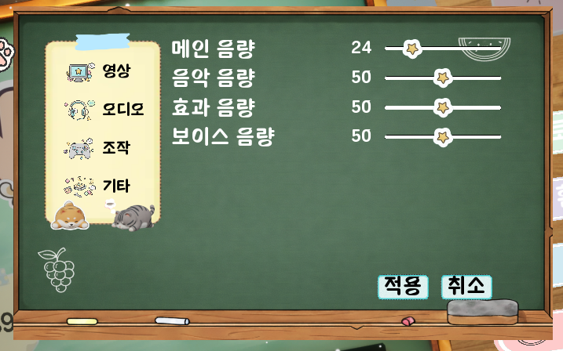

# 🎮 NoobGame (Multiplayer Party Game Project)


> **"다양한 미니게임을 친구들과 함께 즐기는 멀티플레이어 파티 게임"**
>
> *언리얼 엔진 5를 활용한 네트워크 게임 개발 포트폴리오입니다.*

---

## 📋 1. 프로젝트 개요 (Overview)

*   **프로젝트명:** NoobGame
*   **장르:** 멀티플레이어 파티 / 캐주얼 / 서바이벌
*   **개발 인원:** 1인 개발 (원우)
*   **역할:** 기획, 디자인, 레벨 디자인, 애니메이션 리깅, 사운드, 서버 및 시스템 구현 등 **프로젝트 전 과정 단독 수행**
*   **개발 기간:** 2025.07 ~ 2026.02
*   **플랫폼:** PC (Steam)
*   **핵심 목표:**
    *   **프로젝트 전 과정 습득:** 아이디어 기획부터 아트 리소스 제작(리깅, 애니메이션), 프로그래밍, 빌드 및 배포까지 1인 개발의 전체 파이프라인 경험.
    *   언리얼 엔진의 **Replication(네트워크 동기화)** 시스템 심층 이해 및 구현 (Dedicated Server 기반 구조 설계).
    *   확장 가능한 모듈형 게임 아키텍처 설계 (다양한 장르의 미니게임을 하나의 프로젝트에 통합).

---

## 📸 2. 플레이 사진 (Screenshots)

| 메인 메뉴 (Main Menu) | 옵션 (Option) |
| :---: | :---: |
|  |  |

| 로비 (Lobby) | 과일 게임 (Fruit Game) |
| :---: | :---: |
|  |  |

| 미로 게임 (Maze Game) | 퀴즈 게임 (Quiz Game) |
| :---: | :---: |
|  |  |

---

## 🎥 3. 플레이 영상 (Gameplay Video)

> *아래 이미지를 클릭하면 플레이 영상을 시청할 수 있습니다. (YouTube)*

[](https://www.youtube.com/watch?v=YOUR_VIDEO_ID)

---

## 🛠️ 4. 사용 기술 (Tech Stack)

### Engine & Language
*   **Unreal Engine 5.6**: Core Engine (최신 기능 활용)
*   **C++ & Blueprints**: 하이브리드 구조 (C++로 핵심 시스템 구현, BP로 로직/UI 연결)
*   **Visual Studio 2022**: IDE

### Generative AI Tools
*   **Tripo 3D**: 3D 에셋 생성 및 프로토타이핑
*   **Nano Banana**: 텍스처 및 이미지 리소스 생성
*   **Rodin AI**: 3D 모델 최적화 및 변환

### Version Control
*   **Git / GitHub**: 소스 코드 관리
*   **Git LFS**: 대용량 에셋(.blend, .uasset) 관리

---

## 📚 5. 기술 문서 (Technical Docs)

### 5.1 네트워크 아키텍처 (Network Architecture)
*   `ANoobGameStateBase`를 상속받은 각 게임 모드별 State(`MazeGameState`, `FruitGameState`)에서 게임의 진행 상태(남은 시간, 점수, 단계)를 관리하고 리플리케이션합니다.
*   **Dedicated Server** 모델을 기반으로 설계되었으나, 테스트 환경(Listen Server)에서도 호환되도록 `HasAuthority()`와 `IsLocallyControlled()` 분기를 정교하게 처리했습니다.

### 5.2 캐릭터 시스템
*   `ANoobGameCharacter`를 베이스로 하여 다양한 파생 클래스(`CombatCharacter`, `PlatformingCharacter` 등)로 확장.
*   다양한 동물 캐릭터(Cat, Dog, Raccoon)의 스켈레톤 구조 차이를 극복하기 위해 리타겟팅 및 본 매핑 최적화 진행.

---

## 🎮 6. 구현 기능 및 게임 모드 (Game Modes & Features)

### 6.1 과일 게임 (Fruit Game)
*   **핵심 로직**: 서버에서 각 플레이어의 정답 과일(`SecretAnswers`)을 설정하고, 턴마다 제출된 추측과 비교하여 결과를 판정합니다.
*   **구현**: `AFruitGameMode::ProcessPlayerGuess`에서 정답 비교 로직을 수행합니다.

<details>
<summary>💻 정답 비교 및 결과 처리 코드 (FruitGameMode.cpp) - 접기/펼치기</summary>

```cpp
void AFruitGameMode::ProcessPlayerGuess(AController* PlayerController, const TArray<EFruitType>& GuessedFruits)
{
    if (!IsPlayerTurn(PlayerController)) return;

    // ... (중략: 상대방 플레이어 찾기 로직) ...

    const TArray<EFruitType>& OpponentSecret = OpponentPS->GetSecretAnswers_Server();
    int32 MatchCount = 0;
    
    // 정답 비교 로직
    for (int32 i = 0; i < 5; ++i)
    {
        if (GuessedFruits.IsValidIndex(i) && OpponentSecret.IsValidIndex(i) &&
            GuessedFruits[i] == OpponentSecret[i] && GuessedFruits[i] != EFruitType::FT_None)
        {
            MatchCount++;
        }
    }

    // 결과 전송 (RPC)
    AFruitPlayerController* GuesserPC = Cast<AFruitPlayerController>(PlayerController);
    AFruitPlayerController* OpponentPC = Cast<AFruitPlayerController>(OpponentPS->GetPlayerController());
    if (GuesserPC) GuesserPC->Client_ReceiveGuessResult(GuessedFruits, MatchCount);
    if (OpponentPC) OpponentPC->Client_OpponentGuessed(GuessedFruits, MatchCount);

    if (MatchCount == 5) StartWinnerAnnouncement(PlayerController->PlayerState);
    // ...
}
```
</details>

### 6.2 미로 게임 (Maze Game)
*   **핵심 로직**: 시드(Seed) 기반 절차적 미로 생성 및 네트워크 동기화.
*   **구현**: `AMazeGenerate` 액터가 시드값을 받아 미로 구조를 생성하고, 필요한 소품(Prop)과 조명 데이터를 생성하여 `GameState`에 저장, 클라이언트와 동기화합니다.

<details>
<summary>💻 미로 생성 및 동기화 코드 (MazeGenerate.cpp) - 접기/펼치기</summary>

```cpp
void AMazeGenerate::UpdateMazeWithSeed(int32 NewSeed)
{
    this->Seed = NewSeed;

    // 1. 기존 액터 정리 (Goal, Mesh, Lights)
    if (SpawnedGoalActor) { SpawnedGoalActor->Destroy(); SpawnedGoalActor = nullptr; }
    // ... (중략: 정리 로직) ...

    // 2. 미로 알고리즘 실행
    this->ClearMaze();
    this->UpdateMaze();

    // 3. 서버 권한(Authority)이 있는 경우 랜덤 데이터를 생성하여 GameState에 저장 (Replication)
    if (HasAuthority())
    {
        if (AMazeGameState* GS = Cast<AMazeGameState>(UGameplayStatics::GetGameState(GetWorld())))
        {
            TArray<FMazePropData> PD;
            GenerateRandomPropData(PD);
            GS->SetMazePropData(PD); // GameState를 통해 클라이언트에 전파

            TArray<FMazeLightData> LD;
            GenerateRandomLightData(LD);
            GS->SetMazeLightData(LD);
        }
    }

    // 4. 탈출구(Goal) 스폰
    SpawnGoalTrigger(GetActorLocation(), GetActorScale3D());
}
```
</details>

### 6.3 퀴즈 게임 (Quiz Game)
*   **핵심 로직**: 데이터 테이블(`QuizDataTable`) 기반 문제 출제 및 동적 장애물 스폰.
*   **구현**: 난이도에 따라 문제 리스트를 로드하고, 일정 주기마다 장애물(`QuizObstacleBase`)을 스폰하며 속도를 점진적으로 증가시킵니다.

<details>
<summary>💻 퀴즈 스폰 및 속도 증가 로직 (OXQuizGameMode.cpp) - 접기/펼치기</summary>

```cpp
void AOXQuizGameMode::SpawnNextQuizObstacle()
{
    if (!MyGameState || MyGameState->CurrentGamePhase != EQuizGamePhase::GP_Playing) return;

    FQuizData Quiz;
    if (RemainingQuizList.Num() > 0)
    {
        // 랜덤 문제 선택
        int32 Idx = FMath::RandRange(0, RemainingQuizList.Num() - 1);
        Quiz = RemainingQuizList[Idx];
        RemainingQuizList.RemoveAt(Idx);

        // 2지선다/3지선다에 맞는 장애물 클래스 선택
        TSubclassOf<AQuizObstacleBase> ObstacleClass = (Quiz.Answers.Num() == 2) ? QuizObstacleClass_2Choice : QuizObstacleClass_3Choice;

        if (ObstacleClass)
        {
            if (AQuizObstacleBase* NewObs = GetWorld()->SpawnActor<AQuizObstacleBase>(ObstacleClass, ObstacleSpawnTransform, SP))
            {
                NewObs->InitializeObstacle(Quiz, CurrentMoveSpeed);
                ++SpawnedQuizCount;

                // 5문제마다 속도 레벨 증가
                if (SpawnedQuizCount % 5 == 0 && SpeedLevels.IsValidIndex(CurrentSpeedLevelIndex + 1))
                {
                    CurrentSpeedLevelIndex++;
                    CurrentMoveSpeed = SpeedLevels[CurrentSpeedLevelIndex];
                    if (MyGameState) MyGameState->SetCurrentSpeedLevel(CurrentSpeedLevelIndex + 1);
                }
                // ...
            }
        }
    }
    // ...
}
```
</details>

---

## 📂 7. 프로젝트 구조 (Project Structure)

```
C:/Users/qudtn/UnrealEngine/NoobGame
├── Config/               # 엔진 설정 파일
├── Content/              # 블루프린트, 에셋, 맵
│   ├── Blueprints/       # 로비, UI 등 BP
│   ├── Characters/       # 캐릭터 모델링 및 애니메이션
│   ├── Levels/           # Game, Lobby 맵 파일
│   └── UI/               # 위젯 및 이미지 리소스
├── Source/               # C++ 소스 코드
│   └── NoobGame/
│       ├── FruitGame/    # 과일 게임 로직 (GameMode, GameState, Controller)
│       ├── MazeGame/     # 미로 게임 로직 (Generation Algorithm)
│       ├── QuizGame/     # 퀴즈 게임 로직 (Obstacle Spawning)
│       ├── MenuSystem/   # 메뉴 및 UI 시스템
│       ├── NPC/          # NPC AI
│       └── Variant_*/    # 다양한 프로토타입 (Combat, Platforming)
├── 기획/                 # 기획 문서
└── 모델링/               # Blender 원본 파일 (Cat, Dog, Raccoon 등)
```

---

## 🐛 8. 트러블 슈팅 (Troubleshooting)

### 이슈 1: 애니메이션 리타겟팅 시 메쉬 뭉개짐
*   **문제**: 서로 다른 체형(고양이, 강아지, 라쿤)의 캐릭터에 동일한 애니메이션을 적용할 때, 뼈대 구조 차이로 인해 메쉬가 비정상적으로 늘어나거나 뭉개지는 현상 발생.
*   **해결**: `IK Rig`와 `IK Retargeter`를 정밀하게 설정하고, 특히 척추(Spine)와 다리(Leg) 본의 체인 매핑(Chain Mapping)을 각 캐릭터 비율에 맞춰 수동으로 보정하여 해결.

### 이슈 2: Dedicated vs Listen Server 설정 혼동
*   **문제**: Dedicated Server를 상정하고 구현한 로직(`SwitchHasAuthority`만 사용)이 Listen Server(Host가 플레이어도 겸함) 환경에서 Host에게만 중복 실행되거나, Client 로직이 무시되는 문제 발생.
*   **해결**: `HasAuthority()` 체크뿐만 아니라 `IsLocallyControlled()`를 조합하여, 서버 로직과 로컬 클라이언트(Host 포함)의 UI/입력 처리 로직을 명확히 분리.

### 이슈 3: 특정 행동(RPC)이 Host에게만 작동
*   **문제**: 클라이언트가 상호작용 키를 눌렀을 때, `Server RPC`가 호출되지 않거나 반응이 없는 현상.
*   **해결**: 해당 액터의 `Owner`가 플레이어 컨트롤러로 설정되지 않아 RPC 호출 권한이 없음을 확인. `SetOwner`를 통해 소유권을 명확히 하거나, 인터페이스를 통해 컨트롤러를 경유하여 RPC를 호출하는 방식으로 구조 개선.

### 이슈 4: 과일 게임 Niagara/Animation 동기화 실패
*   **문제**: 과일 획득 시 재생되는 파티클(Niagara)과 애니메이션이 Host 화면에서만 보이고 Client에서는 보이지 않음.
*   **해결**: 이펙트 재생은 게임플레이에 영향을 주지 않는 시각적 요소이므로, 서버에서 `NetMulticast` 함수를 호출하여 연결된 모든 클라이언트에서 각각 이펙트를 재생하도록 변경.

### 이슈 5: 퀴즈 게임 캐릭터 위치 끊김 (Jittering)
*   **문제**: 움직이는 벽(Wall)에 캐릭터가 밀릴 때, 위치 동기화 보정(Correction)으로 인해 캐릭터가 심하게 떨리는 현상.
*   **해결**: `CharacterMovementComponent`의 네트워크 보정 임계값을 조정하고, 벽의 이동 방식을 `SetActorLocation` 대신 물리 기반 이동이나 `InterpTo` 로직을 개선하여 서버/클라이언트 간 위치 오차를 최소화.

### 이슈 6: 미로 게임 Goal Trigger 생성 오류
*   **문제**: 절차적으로 생성된 미로에서 도착 지점(Goal Trigger)이 맵 밖이나 벽 속에 생성되어 게임 클리어가 불가능한 버그.
*   **해결**: 미로 생성 알고리즘(`MazeGenerate.cpp`)에서 `PathEnd` 좌표 계산 로직을 디버깅하여, 그리드 인덱스와 월드 좌표 변환 과정의 오차를 수정하고 생성 후 `Overlapping` 체크를 추가하여 유효한 위치인지 검증하는 로직 추가.

---

*Contact: Wonwoo*
